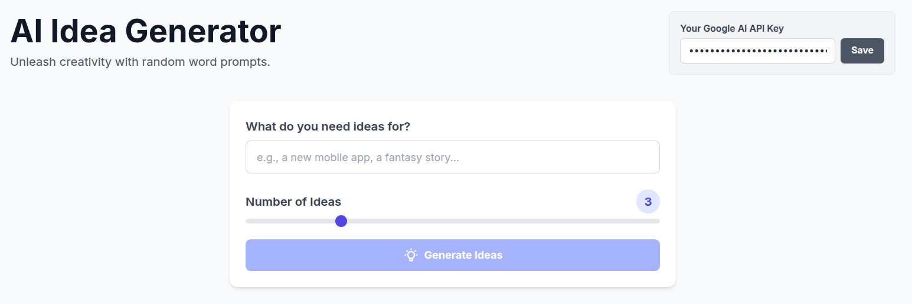

# **AI-Powered Idea Generator**

This is a simple, powerful web application designed to stimulate creative thinking and generate novel ideas. It uses the "Random Word" lateral thinking technique, popularized by Edward de Bono, and leverages the power of Google's Gemini AI to create unique connections.

## **How to Use the App**

The application is designed to be intuitive and straightforward:

1. **Get an API Key**: First, you need a Google AI API key. You can get one for free from the [Google AI Studio](https://aistudio.google.com/app/apikey).
2. **Enter Your API Key**: In the top-right corner of the app, paste your Google AI API key into the input field and click "Save". The key will be saved in your browser's local storage for future visits, so you only need to do this once.
3. **Enter a Topic**: In the main input field, describe what you need ideas for. This can be anything from "a new flavor of ice cream" to "a plot for a science fiction novel" or "a sustainable packaging solution".
4. **Choose the Number of Ideas**: Use the slider to select how many ideas you want to generate (from 1 to 10).
5. **Generate\!**: Once you've entered a key and a topic, the "Generate Ideas" button will become active. Click it to start the process.

The app will then generate the requested number of ideas, each inspired by a unique combination of three random words.

## **The Theoretical Background: De Bono's Random Word Technique**

This tool is a digital implementation of a classic lateral thinking technique developed by **Edward de Bono**, a renowned physician, psychologist, and inventor.

**The Core Problem:** Our brains are brilliant pattern-matching machines. They create fixed pathways of thought based on experience, which is highly efficient for everyday tasks. However, this same efficiency can be a barrier to creativity, as it encourages us to follow the most familiar, logical paths and makes it difficult to break out of our usual patterns of thinking.

**The Solution (Provocation):** De Bono's lateral thinking is about deliberately breaking these patterns. The "Random Word" technique is a simple yet powerful form of **provocation**. Its purpose is to force your brain to make connections where none existed before.

**How It Works:**

1. **Define Your Focus:** You start with a problem or a topic you want to generate ideas about (e.g., "How can we improve our customer service?").
2. **Introduce a Random Word:** You then introduce a completely random, unconnected word (e.g., "cloud").
3. **Force a Connection:** The creative challenge is to find connections, however tenuous, between your focus and the random word. You might think about the attributes of a "cloud" (soft, floating, data storage, covers everything, changes shape) and see how they could apply to customer service.
   * *Could our customer service be more "soft" and gentle?*
   * *Could we "float" above the competition?*
   * *Could we use "cloud" data storage to better remember customer preferences?*

By introducing this random input, you jolt your brain out of its comfortable ruts and force it to explore new, previously unconsidered avenues of thought. This app automates that process by using a large wordlist and an AI to handle the "forced connection" part, generating innovative concepts at the click of a button.

## **Technical Details**

* **Frontend**: A single, static index.html file.
* **Styling**: [Tailwind CSS](https://tailwindcss.com/) loaded via a CDN for rapid, utility-first styling.
* **Logic**: Plain (vanilla) JavaScript.
* **AI**: Makes direct client-side calls to the [Google Gemini API](https://ai.google.dev/).

## **How to Deploy**

This app is a static site, making it incredibly easy to deploy.

1. Download the index.html file from this repository.
2. Sign up for a free account on a platform like [Netlify](https://www.netlify.com/) or [Vercel](https://vercel.com/).
3. Simply drag and drop the index.html file into the deployment dashboard.
4. Your site will be live on the internet in seconds\!
